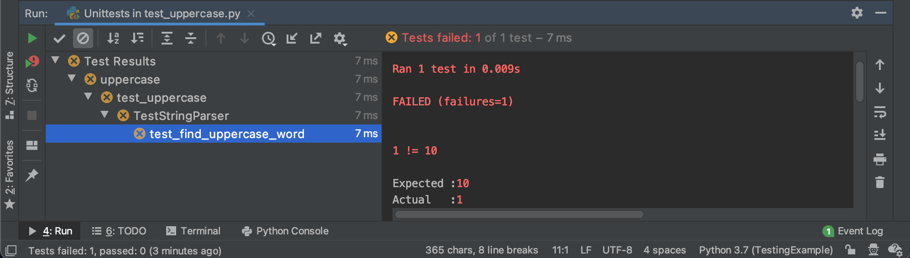
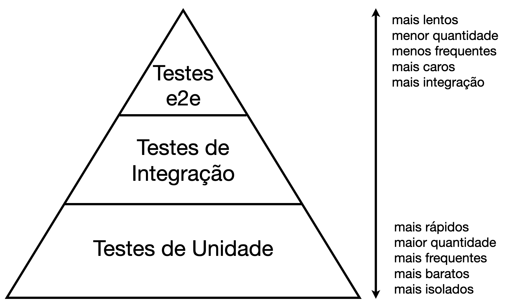
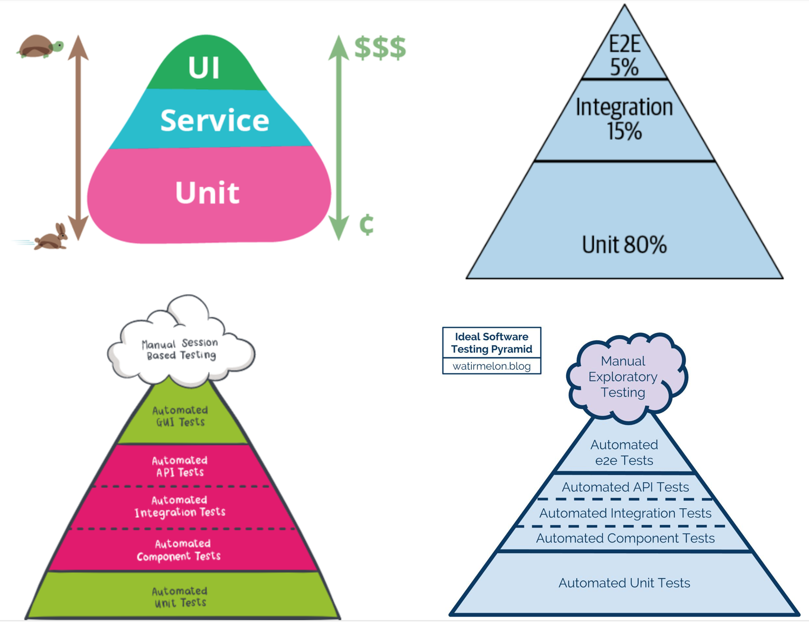

# 1 Introdução

Nesta breve introdução sobre teste de software, iremos abordar a importância dos testes automatizados para o desenvolvimento de software.
Também iremos apresentar alguns exemplos dos principais tipos de testes: unidade, integração e e2e.

## 1.1 O que é Teste de Software?

Sistemas de software são estruturas complexas, muitas vezes formados por milhares de linhas de código, métodos e classes.
A figura abaixo representa os relacionamentos existentes entre os métodos e as classes em um software de porte médio.
Nota-se o quão complexo um sistema pode se tornar.
Ao longo do tempo e à medida que novos requisitos são demandados pelos usuários, tal complexidade pode aumentar.
Portanto, manter e evoluir um sistema de software é uma atividade desafiadora e não trivial.


Ao realizar manutenção e evolução de software, os desenvolvedores podem inserir erros, que, por sua vez, podem chegar aos usuários e causar danos.
Os tipos de erros variam bastante, desde um simples defeito na UI (por exemplo, um botão no lugar incorreto), a erros de cálculos, gerando grandes prejuízos ([link](https://en.wikipedia.org/wiki/List_of_software_bugs)).
Após sofrer uma modificação, o software pode também não funcionar como anteriormente, alterando o comportamento esperado do sistema.
Para evitar que tais problemas ocorram e cheguem nos usuários finais, é fundamental introduzir atividades de **teste de software** em projetos de desenvolvimento de software.
Mas o que é teste de software?

Na Wikipédia, encontramos a seguinte definição mais ampla sobre Teste de Software:

> Software testing is an investigation conducted to provide stakeholders with information about the quality of the software product or service under test ([link](https://en.wikipedia.org/wiki/Software_testing)).

Teste de software pode ser visto como um modo de **mensurar a qualidade de sistema**.
Isto é, quanto mais (bons) testes um sistema possui, geralmente, maior é a sua qualidade.
Apesar de qualidade ser um termo muito amplo, a presença de testes é um fator inerentemente relacionado a bons programas.
Além do foco em qualidade, outra característica associada aos testes de software é a detecção de bugs:

> Software testing techniques are particularly useful in reducing the number of bugs that reach production, and the amount of time they remain in production ([link](https://www.oreilly.com/library/view/the-site-reliability/9781492029496)).

Teste de software **reduz o número de bugs** (erros) no sistema, evitando que eles cheguem em produção e impacte os usuários finais.
Considere o seguinte cenário hipotético: uma empresa possui 100 desenvolvedores experientes; cada desenvolvedor insere acidentalmente apenas um bug por mês no sistema.
Mesmo nesse cenário otimista, esse grupo de desenvolvedores experientes vai produzir 5 novos bugs por dia útil, ou seja, 25 bugs por semana e 1.200 por ano.
Sem testes, esse é um cenário difícil de controlar e a quantidade de bugs vai tender a crescer ao longo do tempo.

Na prática, testes de software podem ser realizados de forma manual ou automatizada.
Testes manuais ocorrem através da inspeção manual do sistema alvo, por exemplo, a validação manual de uma interface gráfica de um sistema web para garantir um certo layout.
No entanto, testes manuais são lentos, caros e suscetíveis a falhas, uma vez que são realizados manualmente.
Portanto, a maior parte dos testes atualmente são automatizados.

> [!TIP]
> **Teste o seu software, ou os seus usuários o farão.**
> Todo software é testado, pelos desenvolvedores ou pelos usuários.
> Não deixe que os usuários encontre erros para você (fonte: The Pragmatic Programmer).

## 1.2 Testes Automatizados

Testes automatizados, em essência, são pequenos programas que chamam outros programas que desejamos testar e verificam se eles retornam os valores esperados.
A grande vantagem desses testes é que podemos rodá-los diversas vezes (centenas ou milhares de vezes por dia).
Testes automatizados são amplamente adotados na indústria de software e uma das práticas de programação mais valorizadas do mercado.
De acordo com Engenheiros de Software da Google, testes automatizados apresentam as seguintes vantagens:

> Automated testing can prevent bugs from escaping into the wild and affecting your users. The later in the development cycle a bug is caught, the more expensive it is; exponentially so in many cases. However, “catching bugs” is only part of the motivation. An equally important reason why you want to test your software is to support the ability to change ([link](https://www.oreilly.com/library/view/software-engineering-at/9781492082781)).

De fato, é importante adotar testes automatizados para a **detecção de erros mais cedo no ciclo de desenvolvimento** (por exemplo, quando o código ainda não entrou em produção).
Detectar e corrigir erros mais cedo custa mais barato do que quando eles são encontrados mais tarde, quando o sistema já está em produção e em uso pelos usuários.
Além do foco na detecção de erros, testes automatizados **fornecem suporte à capacidade de mudança**.
Ou seja, ao realizar uma alteração no código, os desenvolvedores podem ter um feedback rápido sobre aquela modificação, tornando possível alterar o software com mais confiança.
Consequentemente, os desenvolvedores evoluem o software com maior velocidade e confiabilidade.

O ato de escrever testes também está relacionado com um grande benefício: **ajudar a melhorar o projeto do sistema**.
Ao escrever os testes, devemos refletir e elaborar sobre o projeto do código para que ele possa ser mais facilmente testado:

> The act of writing tests also improves the design of your systems. As the first clients of your code, a test can tell you much about your design choices.
Is your system too tightly coupled to a database?
Writing automated tests forces you to confront these issues early on in the development cycle
 ([link](https://www.oreilly.com/library/view/software-engineering-at/9781492082781)).

Devido às diversas vantagens dos testes automatizados, código sem testes é normalmente visto como código sem qualidade, pois não temos como alterar código com confiança.
Existe uma famosa frase de Michael Feathers (autor do livro *Working Effectively with Legacy Code*): "*legacy code is simply code without tests*".
Isto é, código legado é código sem testes.
O autor vai além e declara:

> Code without tests is bad code. It doesn’t matter how well written it is; it doesn’t matter how pretty or object-oriented or well-encapsulated it is. With tests, we can change the behavior of our code quickly and verifiably. Without them, we really don’t know if our code is getting better or worse ([link](https://www.oreilly.com/library/view/working-effectively-with/0131177052)).

### Um Primeiro Exemplo

O método `count_uppercase_words`, implementado em Python, conta o número de palavras escritas em letras maiúsculas em um dado texto.
Para testar o funcionamento do nosso contador de palavras, devemos escrever testes automatizados.
O alvo do teste também é conhecido com **SUT** (*system under test*, isto é, sistema sob teste).

```python
# SUT
class StringParser:

    def count_uppercase_words(self, text):
        counter = 0
        for word in text.split():
            if word.isupper():
                counter += 1
        return counter
```

Apresentamos em seguida três testes automatizados para o nosso SUT: `test_find_uppercase_word`, `test_find_multiple_uppercase_words` e `test_not_find_uppercase_word`:

```python
# Tests
def test_find_uppercase_word():
    parser = StringParser()
    counter = parser.count_uppercase_words("ABC")
    assert counter == 1

def test_find_multiple_uppercase_words():
    parser = StringParser()
    counter = parser.count_uppercase_words("ABC DEF")
    assert counter == 2

def test_not_find_uppercase_word():
    parser = StringParser()
    counter = parser.count_uppercase_words("abc")
    assert counter == 0
```

- O primeiro teste, `test_find_uppercase_word`, chama o SUT (`count_uppercase_words`) e verifica se uma palavra em maiúscula (isto é, `ABC`) é corretamente encontrada.
Para verificar o resultado, estamos utilizando o comando `assert`.
Caso o valor esperado (isto é, 1) seja retornado pelo SUT, o teste passa com sucesso.
Caso o valor esperado não seja retornado, um erro será lançado para o desenvolvedor informando que o teste falhou, ou seja, que o SUT contém algum erro.

- O teste `test_find_multiple_uppercase_words` é similar ao anterior, mas verifica se múltiplas palavras em maiúsculas são devidamente encontradas.

- Por fim, o método de teste `test_not_find_uppercase_word` verifica o caso onde nenhuma palavra em maiúscula deve ser encontrada.

O exemplo acima é intencionalmente muito simples.
Na prática, testes automatizados são escritos com o suporte de **frameworks de teste**.
No entanto, em essência, todo teste automatizado é bastante similar ao exemplo apresentado.

## 1.3 Frameworks de Teste

Frameworks de teste são utilizados para a criação de testes automatizados.
Hoje em dia, existem centenas de frameworks de teste disponíveis para as mais variadas linguagens de programação.
Por exemplo,
[JUnit](https://junit.org) para Java,
[unittest](https://docs.python.org/3/library/unittest.html) e
[pytest](https://pytest.org) para Python,
[Jasmine](https://jasmine.github.io),
[Mocha](https://mochajs.org) e
[Jest](https://jestjs.io) para JavaScript, apenas para listar alguns.
Pode-se verificar uma lista completa de frameworks existentes na atualidade para várias linguagens de programação ([link1](https://github.com/atinfo/awesome-test-automation) e [link2](https://en.wikipedia.org/wiki/List_of_unit_testing_frameworks)).

Mas por que devemos utilizar frameworks de teste?
Frameworks de teste facilitam a escrita e a execução do conjunto testes (também conhecido como **suíte de testes**), assim como a geração de relatórios com os resultados da execução.

### Escrita de Testes

Para facilitar a escrita de testes, um conjunto de classes e métodos são fornecidos pelos frameworks de teste.
Essas entidades auxiliam na verificação dos resultados e permitem organizar melhor os testes.
Com isso, podemos comparar mais facilmente os resultados esperados e obtidos assim como garantir que recursos sejam corretamente inicializados e destruídos, dentre outros.
Por exemplo, o JUnit possui diversos métodos para auxiliar na verificação dos resultados, tais como `assertEquals`, `assertTrue`, e  `assertFalse` ([link](https://junit.org/junit5/docs/5.0.1/api/org/junit/jupiter/api/Assertions.html)).
O unittest possui métodos equivalentes, e também outros mais adequados para Python, como `assertIsNone`, `assertIn` e  `assertIs` ([link](https://docs.python.org/3/library/unittest.html#unittest.TestCase)).
Independente da linguagem de programação, os frameworks de teste fornecem um conjunto de funcionalidades equivalentes.

A seguir, escrevemos o teste `test_find_uppercase_word` com o suporte de cinco frameworks de teste populares: unittest (Python), pytest (Python), JUnit (Java), Jasmine (JavaScript) e Jest (JavaScript).
Escolhemos cinco frameworks de teste distintos para reforçar que, apesar das diferenças de sintaxe, seus objetivos são exatamente os mesmos.

Em Python, com o **unittest**, devemos criar uma classe de teste (neste caso, `TestStringParser`) que deve herdar da classe `unittest.TestCase`.
Além disso, o método de teste deve possuir o prefixo "test".
Note que utilizamos o comando `assertEqual` do unittest para comparar o resultado esperado e o resultado obtido.
No **pytest**, a criação de testes é um pouco mais simples: os testes são funções regulares que começam com "test", ou seja, não é necessário utilizar herança como no unittest.
Além disso, podemos utilizar o comando `assert` nativo da própria linguagem Python.

```python
# unittest
class TestStringParser(unittest.TestCase):

  def test_find_uppercase_word(self):
      parser = StringParser()
      counter = parser.count_uppercase_words("ABC")
      self.assertEqual(counter, 1)
```

```python
# pytest
def test_find_uppercase_word():
    parser = StringParser()
    counter = parser.count_uppercase_words("ABC")
    assert counter == 1
```

Em Java, com o **JUnit**, devemos criar uma classe de teste (neste caso, `TestStringParser`).
O método de teste deve possuir a anotação `@Test` do framework de teste, mas não é necessário que ele tenha o prefixo "test":

```java
// JUnit
public class TestStringParser {

  @Test
  public void findUppercaseWord() {
    StringParser parser = new StringParser();
    int counter = parser.countUppercaseWords("ABC");
    assertEquals(counter, 1);
  }
}
```

O teste no **Jest** é bastante similar: o teste ocorre dentro de um bloco `test` e estamos utilizando os comandos `expect` e `toBe`.
Observe que estamos utilizando `expect` e `toEqual` para a comparação do resultado de modo equivalente aos "asserts" usados anteriormente.
Em JavaScript, comandos do tipo "expect" são mais comuns do que comandos "assert", mas o objetivo de ambos é exatamente o mesmo.

```javascript
// Jest
describe('StringParser', () => {
  test('finds uppercase word', () => {
    let parser = new StringParser();
    let counter = parser.count_uppercase_words("ABC");
    expect(counter).toBe(1);
  });
})
```

> [!NOTE]
> **Testes em JavaScript.**
> Em JavaScript, a escolha de um framework de testes não é tão simples e direta quanto em outras linguagens, como Java e Python.
> Em Java, o framework JUnit é amplamente adotado e praticamente não possui concorrentes, enquanto Python possui apenas dois frameworks mais populares (unittest e pytest).
> Na linguagem JavaScript, o ecossistema de frameworks de testes é muito mais amplo ([link](https://stackoverflow.blog/2018/01/11/brutal-lifecycle-javascript-frameworks)).
> Além dos três frameworks já mencionados ([Jasmine](https://jasmine.github.io), [Mocha](https://mochajs.org) e [Jest](https://jestjs.io)), existem diversos outros, tais como [QUnit](https://qunitjs.com), [AVA](https://github.com/avajs/ava), [Karma](https://karma-runner.github.io) e [Testing Library](https://testing-library.com/), dentre outros.
> Além disso, dependendo do framework de teste selecionado, pode ser necessário escolher também uma biblioteca de asserção, como o [Chai](https://www.chaijs.com).
> O site [stateofjs](https://stateofjs.com) lista os principais frameworks de teste da atualizade em JavaScript.

> [!TIP]
> **Foque em aprender princípios e fundamentos de teste.**
> É importante conhecer bem frameworks e ferramentas de teste.
> No entanto, conceitos e fundamentos tendem a ser duradouros e independentes de tecnologia.

### Execução de Testes

Um segundo benefício dos frameworks de teste é facilitar a execução dos testes.
No mundo real, sistemas de software podem conter milhares de testes.
Portanto, frameworks de teste permitem a execução dos testes de forma simples e rápida.
Testes são facilmente executados via linha de comando ou através de IDEs de programação.
Por exemplo, grande parte dos frameworks de teste são integrados a IDEs de programação ([Eclipse](https://www.eclipse.org/community/eclipse_newsletter/2017/october/article5.php), [NetBeans](https://netbeans.org/kb/docs/java/junit-intro.html), [VSCode](https://code.visualstudio.com/docs/python/testing), [IntelliJ](https://www.jetbrains.com/help/idea/testing.html), [PyCharm](https://www.jetbrains.com/help/pycharm/testing-your-first-python-application.html#run-test), etc.), o que permite tornar a execução dos testes uma tarefa trivial, frequente e parte do dia a dia do desenvolvedor.
Por exemplo, para rodar os testes através unittest na linha de comando, basta utilizar o seguinte comando no diretório onde os testes estão localizados:

```shell
$ python -m unittest
```

As interfaces de linha comando geralmente permitem que os desenvolvedores customizem a execução dos testes.
Por exemplo, no unittest é possível executar testes específicos, classes de teste ou mesmo métodos de teste individuais:

```shell
$ python -m unittest test_module1 test_module2
$ python -m unittest test_module.TestClass
$ python -m unittest test_module.TestClass.test_method
```

A facilidade para executar os testes simplifica também a integração com ferramentas de CI/CD ([Continuous Integration](https://en.wikipedia.org/wiki/Continuous_integration) e [Continuous Delivery](https://en.wikipedia.org/wiki/Continuous_delivery)), tornando a execução da suíte de testes uma tarefa contínua durante o processo de desenvolvimento de software e produção de releases.
Com o suporte dessas ferramentas, pode-se executar os testes diversas de vezes ao dia, requerendo atenção humana apenas quando o teste falha.

### Geração de Relatórios
Além de facilitar a escrita e a execução dos testes, os frameworks de teste também simplificam a geração de relatórios de teste.
Na prática, quando os testes são executados, queremos facilmente identificar os testes que falharam (ou verificar que todos passaram).
Por exemplo, ao executar o unittest via linha de comando, obtemos o seguinte relatório, indicando que todos os testes passaram com sucesso (apenas 1 teste nesse caso):

```shell
$ python -m unittest
...
----------------------------------------------------------------------
Ran 1 test in 0.001s

OK
```

Por outro lado, caso ocorra um erro na implementação do código, o teste deve falhar.
Suponha que o nosso contador de palavras maiúsculas contém um erro, onde o método `count_uppercase_words` incrementa 10 ao invés de 1.
Consequentemente, o teste `test_find_uppercase_word` vai falhar.
Portanto, ao rodar o teste, teremos a seguinte falha destacando que o resultado esperado era 1, mas o valor obtido foi 10 (`AssertionError: 1 != 10`).
Note também, que o relatório indica quantos testes rodaram (`Ran 1 `), quantos testes falharam `(failures=1)` e onde exatamente a falha ocorreu (`File "test_uppercase.py", line 9, in test_find_uppercase_word`).

```shell
$ python -m unittest
...
======================================================================
FAIL: test_find_uppercase_word (uppercase.test_uppercase.TestStringParser)
----------------------------------------------------------------------
Traceback (most recent call last):
  File "test_uppercase.py", line 9, in test_find_uppercase_word
    self.assertEqual(counter, 1)
AssertionError: 10 != 1

----------------------------------------------------------------------
Ran 1 test in 0.001s

FAILED (failures=1)
```

A figura a seguir apresenta o mesmo relatório, mas gerado a partir da IDE de programação PyCharm para Python.
Conforme esperado, a informação mostrada na IDE é exatamente a mesma da linha de comando, indicando para o desenvolvedor o total de testes e falhas, assim como a localização das falhas.



## 1.4 Tipos de Teste

Existem diferentes tipos de testes para resolver diferentes problemas.
Uma forma de classificar os testes é através da **pirâmide de testes**, proposta por Mike Cohn ([link](https://learning.oreilly.com/library/view/succeeding-with-agile/9780321660534)) e amplamente adotada na literatura e na indústria de software.
A pirâmide de testes divide os testes em três tipos: testes de unidade, testes de integração e testes end-to-end (e2e).



### Testes de Unidade

Testes de unidade verificam automaticamente pequenas unidades do código, por exemplo, um método, uma classe ou um conjunto de classes.
Esses testes formam a base da pirâmide, pois são os testes mais comuns em um sistema de software.
Testes de unidade são pequenos, estáveis, simples de escrever e rodam rapidamente.
Como são testes menores e mais focados, a identificação das falhas também se torna mais fácil.
Os testes escritos no início deste capítulo são testes de unidade:

```python
# SUT
count_uppercase_words()

# Unit tests
test_find_uppercase_word()
test_find_multiple_uppercase_words()
test_not_find_uppercase_word()
```

A seguir apresentamos testes de unidade existentes do sistema Guava ([link](https://github.com/google/guava/blob/master/guava-tests/test/com/google/common/collect/CountTest.java)), uma biblioteca da Google que fornece funções básicas para lidar com coleções, grafos, concorrência, dentre outras.
O teste é escrito na linguagem Java com o framework JUnit.
O sistema sob teste é a classe `Count`, que representa um contador simples:

```java
// SUT
class Count {
  private int value;

  Count(int value) {
    this.value = value;
  }

  public int get() {
    return value;
  }

  public void add(int delta) {
    value += delta;
  }

  public int addAndGet(int delta) {
    return value += delta;
  }
}
```

A classe de teste `CountTest` a seguir verifica o funcionamento de `Count`.
Temos três testes de unidade: `testGet`, `testAddAndGet` e `testGetAndAdd`.
Observe que não necessariamente há um mapeamento um-para-um entre métodos do SUT e métodos de testes.
Por exemplo, existe um teste para o método `get` (isto é `testGet`), no entanto, não existe um teste específico para o método `add`.
Além disso, o método de teste `testGetAndAdd` não testa um método especificamente, mas sim um conjunto de métodos.


```java
// Unit tests
public class CountTest {

  @Test
  public void testGet() {
    Count holder = new Count(20);
    assertEquals(20, holder.get());
  }

  @Test
  public void testAddAndGet() {
    Count holder = new Count(20);
    assertEquals(21, holder.addAndGet(1));
  }

  @Test
  public void testGetAndAdd() {
    Count holder = new Count(20);
    assertEquals(20, holder.get());
    holder.add(1);
    assertEquals(21, holder.get());
  }
}
```

Existem *diversas* boas práticas para a escrita de bons testes de unidade.
Por exemplo, uma boa prática destaca que devemos escrever um teste para cada *comportamento* do SUT e não para cada método.
Outras boas práticas destacam que devemos testar o SUT através de suas APIs públicas e que os testes devem ser focados e consisos.

> [!NOTE]
> **Quantidade de testes.**
> Na Google, uma diretriz apresenta que, de forma geral, testes de unidade devem corresponder a 80% do total de testes, seguido por 15% de testes de integração e 5% de testes end-to-end ([link](https://www.oreilly.com/library/view/software-engineering-at/9781492082781)).

### Testes de Integração

Na parte intermediária da pirâmide, temos os **testes de integração**, também conhecido como **testes de serviço**.
Tais testes normalmente verificam a interação entre componentes ou uma funcionalidade completa do sistema de modo separado da interface de usuário (UI).
Testes de integração podem envolver a comunicação com serviços externos, como banco de dados, APIs externas e sistemas de arquivos.
Esses testes são mais lentos, mais caros e menos frequentes que os testes de unidade.

A seguir mostramos um teste de integração encontrado no sistema Django ([link](https://github.com/django/django/blob/master/tests/file_storage/tests.py)), um framework para a criação de aplicações web.
O teste é escrito na linguagem Python com o suporte do unittest.
O teste `test_file_save_with_path` verifica se um arquivo é salvo corretamente no sistema de arquivos.
Inicialmente, salvamos um arquivo chamado *path/to/test.file* com o conteúdo *file saved with path*.
Em seguida, por meio do comando `assertTrue`, verificamos se o arquivo existe de fato no sistema de arquivos através da API `os.path.exists`.
Após, abrimos o arquivo recém-salvo e verificamos o seu conteúdo através do comando `assertEqual`.
Por fim, deletamos o arquivo criado através de `self.storage.delete`.

```Python
# Integration test
def test_file_save_with_path(self):
    self.storage.save('path/to/test.file', ContentFile('file saved with path'))

    self.assertTrue(os.path.exists('path/to/test.file'))
    with self.storage.open('path/to/test.file') as f:
        self.assertEqual(f.read(), b'file saved with path')

    self.storage.delete('path/to/test.file')
```

### Testes End-to-End (e2e)

Finalmente, no topo da pirâmide, temos os **testes end-to-end (e2e)**, também chamados de **testes funcionais**, **testes de sistema** e **testes de UI**.
Esses testes simulam o uso do sistema por usuários e são normalmente realizados na UI do sistema.
Testes end-to-end são mais lentos, mais caros e menos frequentes quando comparados aos testes de unidade e integração.
Esses testes também são mais frágeis, uma vez que podem ser mais facilmente impactados por alterações na UI do sistema sob teste.

O teste a seguir apresenta um exemplo bastante simples de teste end-to-end, escrito em Python e com o framework unittest.
O teste `test_can_query_on_google` simula uma busca na web através de um navegador e verifica a página retornada.
Especificamente, o teste executa as seguintes tarefas:
(1) abre o navegador Firefox,
(2) entra no site *google.com*,
(3) busca por *software testing*,
(4) verifica se o título da página retornada contém *software testing* e
(5) fecha o navegador.
Para realizar essas operações, utiliza-se também o framework [Selenium](https://www.selenium.dev), que auxilia no teste de aplicações web.

```Python
# e2e test with Selenium
def test_can_query_on_google(self):
    self.driver = webdriver.Firefox() #1
    self.driver.get("http://google.com") #2

    element = self.driver.find_element_by_name("q")
    element.send_keys("software testing") #3
    element.submit()

    self.assertIn("software testing", self.driver.title) #4

    self.driver.quit() #5
```

Note que todos os testes (unidade, integração e end-to-end) fazem uso de frameworks de teste.
O último exemplo utiliza dois frameworks (unittest e Selenium).
Além do Selenium, existem diversos frameworks que facilitam a criação de testes end-to-end, tais como [Playwright](https://playwright.dev/python), [Cypress.io](https://www.cypress.io/), [Nightwatch.js](https://nightwatchjs.org), [Puppeteer](https://pptr.dev) e [TestCafe](https://testcafe.io).

### Outras Pirâmides de Testes

A pirâmide de testes apresentada no início desta seção é a forma mais comum para se categorizar os principais tipos de testes, mas não é a única. Existem diversas pequenas variações da pirâmide de teste. A figura a seguir apresenta algumas dessas variações: as duas pirâmides superiores são versões propostas por Martin Fowler ([link](https://martinfowler.com/bliki/TestPyramid.html)) e
pelo livro *Software Engineering at Google* ([link](https://www.oreilly.com/library/view/software-engineering-at/9781492082781)), respectivamente. Ambas são equivalentes à pirâmide original proposta por Mike Cohn, que divide os testes em três categorias. Já as duas pirâmides inferiores são versões mais detalhadas da versão original ([link1](https://www.devopsgroup.com/insights/resources/diagrams/all/the-testing-pyramid/) e [link2](https://alisterbscott.com/kb/testing-pyramids)). A principal diferença é um maior detalhamento dos testes nas camadas intermediárias e a separação no topo da pirâmide dos **testes manuais** (também conhecidos como **testes exploratórios**). De fato, todas as pirâmides apontam para a mesma ideia, onde os testes da base são mais rápidos, baratos e frequentes enquanto os testes no topo são mais lentos, caros e raros.



## 1.5 Benefícios

No início do capítulo, vimos que testes de software ajudam na detecção de erros no software.
No entanto, esse não é o único benefício dos testes.
Eles também aumentam a produtividade dos desenvolvedores e ajudam a melhorar o projeto do sistema.

### Prevenir Erros

A execução de bons testes ajuda na detecção de bugs.
Como já vimos, quanto mais cedo esses erros são detectados, mais barato é a sua correção.
Quando o erro ocorre em produção, sua correção é muito mais cara pois o sistema já está em uso.
Por outro lado, quando o erro é detectado previamente, sua correção pode ser feita de forma mais simples, com menos impacto.
Claro, para que erros sejam detectados é necessário que bons testes sejam escritos, verificando não somente entradas triviais, mas também entradas limites e exceções.
Falamos então que os testes funcionam como uma **rede de proteção** contra a inserção de erros em sistemas de software.
O desenvolvedor pode então contar com essa rede para alterar o software com mais confiança.

É importante deixar claro que, por melhor que sejam os nossos testes, eles não garantem que o sistema está livre de bugs.
Nesse contexto, existe uma famosa frase de Dijkstra: "*Testing shows the presence, not the absence of bugs*".
Ao testar, fornecemos entradas e verificamos saídas, mas, normalmente, o espaço de possíveis entradas é muito grande, não sendo possível testar todas as possibilidades.

> [!TIP]
> **Dica: Teste de software é um poderoso detector de bugs.**
> Quando temos uma boa rede de proteção através dos testes, bugs inseridos no código podem ser rapidamente detectados e corrigidos (fonte: Refactoring: Improving the Design of Existing Code).

> [!TIP]
> **Dica: Você não vai encontrar todos os bugs.**
> Seu papel é encontrar a maior quantidade de bugs que conseguir e os mais importantes, testando as mais variadas entradas.
> No entanto, não é possível encontrar todos os bugs de um sistema (fonte: Lessons Learned in Software Testing).

### Melhorar o Projeto do Sistema

Detecção de bugs talvez seja o objetivo mais conhecido dos testes.
No entanto, esse não é o único benefício dos testes.
Quando o código é difícil de ser testado, isso é um indicativo que o código possui algum problema de projeto.
Por exemplo, o código pode possuir muitas dependências (alto acoplamento) ou muitas responsabilidades (baixa coesão).
Testar código com muitas dependências é uma tarefa difícil, pois tais dependências também devem ser criadas dentro do teste, tornando o teste mais complexo.
Ao testar código com múltiplas responsabilidades, possivelmente teremos um teste mais genérico e menos focado para cobrir as diversas responsabilidades.
Por outro lado, códigos com bons projetos, ou seja, com poucas dependências (baixo acoplamento) e responsabilidades específicas (alta coesão), são normalmente mais fáceis de serem testados.

Alguns autores defendem que o benefício primário dos testes ocorre quando **pensamos sobre e escrevemos os testes**, não quando os executamos ([link](https://learning.oreilly.com/library/view/the-pragmatic-programmer/9780135956977)).
Escrever testes para algum código é uma forma de exercitar o projeto deste código.
Por exemplo, ao escrever um teste para um método recém-criado, devemos pensar em como utilizar aquele método, como um usuário do método sob uma perspectiva externa.
Portanto, podemos refletir melhor sobre as entradas (parâmetros) e saídas (retorno) daquele método.

Considere o seguinte exemplo: você deve implementar uma funcionalidade para encontrar os usuários mais ativos em uma rede social; tais usuários são aqueles que curtem mais posts por dia.
Podemos então escrever o seguinte método:

```Python
def find_top_users():
  ...
```

Mas como testar esse método?
Provavelmente `find_top_users` faz uma consulta no banco de dados para retornar os usuários mais ativos.
No teste, possivelmente vamos querer alimentar esse banco de dados com dados de teste.
Portanto, chamar o método `find_top_users` diretamente no teste seria complicado pois não temos acesso a esse banco de dados.
Podemos então tornar o método mais flexível, criando um parâmetro para passar banco de dados (ao invés de chamar diretamente no método):

```Python
def find_top_users(db):
  ...
```

Outro problema: o que são os usuários ativos?
Na especificação ainda não está claro o que seria exatamente um usuário ativo, portanto, devemos pensar em uma solução para superar essa limitação.
Podemos definir o número de curtidas através de um parâmetro.
Caso este requisito mude, podemos facilmente alterar os testes:

```Python
def find_top_users(db, number_of_likes):
  ...
```

Observe que pensamos sobre os testes antes mesmo de implementar o código de `find_top_users`.
Isso nos ajudou a alterar a API do método, tornando o método menos acoplado ao banco de dados e aumentando a sua flexibilidade.

> [!TIP]
> **O teste é o primeiro usuário do seu código.**
> Testes fornecem feedback para guiar a codificação, pois elaboramos sobre a utilização do código como um usuário.
> Códigos com bons projetos são mais fáceis de serem testados (fonte: The Pragmatic Programmer).

### Aumentar Produtividade

Em um primeiro momento pode parecer contraintuitivo que a adoção de testes cause o aumento de produtividade.
Afinal, se escrever testes representa escrever mais código, como a produtividade pode aumentar?
Na verdade, sistemas de software que adotam testes tendem a ganhar em diversos outros aspectos ([link](https://www.oreilly.com/library/view/software-engineering-at/9781492082781)):

- **Aumento da confiança em alterações.**
Todo sistema de software muda ao longo do tempo, por exemplo, para adicionar novas funcionalidades, corrigir um bugs, refatorar, etc.
Em sistemas de software com bons testes, os desenvolvedores podem alterar o código com mais confiança pois os testes fornecem uma proteção.
Ou seja, o comportamento do sistema está sempre sendo verificado através dos testes.
Caso um defeito seja inserido, ele será rapidamente detectado e pode ser corrigido.

- **Menos depuração.**
Código testado tende a conter menos defeitos, portanto, os desenvolvedores perdem menos tempo com atividades de depuração (para encontrar e corrigir defeitos).
Um teste escrito uma única vez continua sendo válido por muito tempo, durante todo o ciclo de vida do projeto.

- **Melhoria na documentação.**
A documentação de software é frequentemente defasada e não confiável.
Isso ocorre pois a documentação normalmente não é atualizada à medida que o software evolui.
Bons testes podem ser vistos como uma forma de documentação "viva" e atualizada, pois o teste está sempre em concordância com o sistema sob teste.
Testes podem então ser consultados por desenvolvedores para aprenderem como um determinado trecho de código funciona, como se fossem exemplos de uso.

- **Facilita revisão de código.**
Muitas vezes, antes de ser integrado à base de código principal, o código escrito por um desenvolvedor precisa ser revisado.
Código com teste facilita a atividade de revisão de código pois o revisor pode inspecionar o teste em busca dos casos cobertos e não cobertos.

- **Releases mais rápidas e com mais qualidade.**
Com testes automatizados, releases podem a ser lançadas com mais frequência e com menos defeitos.
Isso não seria possível sem testes automatizados.

### Cultura de Testes

> [!NOTE]
> **Google em 2005.**
> Quando a Google passava por um grande crescimento em 2005, um dos seus principais projetos, o GWS (*Google Web Server*, servidor web responsável por lidar com pesquisas web) aumentava bastante em tamanho e complexidade.
> Logo, a produtividade dos seus desenvolvedores caiu significativamente.
> As releases do GWS passaram a conter mais bugs e os membros das equipes tinham pouca confiança em alterar serviços, pois frequentemente causavam problemas em produção.
> Para lidar com esse problema, foi estabelecido uma política de testes automatizados: todas as novas alterações de código deveriam incluir testes, e esses testes deveriam ser executados continuamente.
> Rapidamente, a quantidade de bugs caiu de modo significativo.
> Mesmo com o grande crescimento da empresa, os testes trouxeram produtividade e confiança para um dos projetos mais importantes da Google.
> Hoje em dia, o GWS possui milhares de testes e lançamentos de releases quase diários com poucas falhas visíveis aos clientes
([link](https://www.oreilly.com/library/view/software-engineering-at/9781492082781)).

A experiência da Google com o GWS ilustra a importância do estabelecimento de uma cultura de testes.
Isto é, idealmente, todo código deve incluir testes automatizados e estes devem ser executados continuamente.
Uma forma de introduzir testes gradualmente é focar em testar as novas alterações.
Por exemplo, um projeto que não adota testes pode passar a testar as novas funcionalidades.

A cultura de testes pode surgir por necessidade do projeto, como no caso do GWS.
No entanto, o desenvolvedor não deve esperar essa demanda da empresa.
Teste é parte da atividade de programação.
O desenvolvedor que implementa uma classe, método ou funcionalidade também deve implementar os seus testes.
Tipicamente, teste não é algo que deve ser deixado para outros departamentos ou profissionais.
Codificação e teste: ambos são programação.
A seguinte frase de um conhecido desenvolvedor ilustra bem o impacto que a cultura de testes pode trazer para a carreira de um profissional:

> O que mais contribuiu para qualidade de software na minha carreira não foi OO, linguagens de alto nível, programação funcional, tipagem forte, MVC ou qualquer outra coisa, mas o surgimento de uma cultura de testes (Tim Bray, desenvolvedor, ex-Google, Amazon e Sun Microsystems, co-autor da especificação do XML, [link](https://www.tbray.org/ongoing/When/202x/2021/05/15/Testing-in-2021)).

## Bibliografia

- Software Engineering at Google
- Engenharia de Software Moderna: Princípios e Práticas para Desenvolvimento de Software com Produtividade
- Refactoring: Improving the Design of Existing Code
- The Pragmatic Programmer
- Working Effectively with Legacy Code
- Lessons Learned in Software Testing: A Context-Driven Approach

## Exercícios

1. Por qual razão devemos testar o software que desenvolvemos? Apresente três justificativas.
2. Por que corrigir um erro mais cedo (quando o código ainda não entrou em produção) custa mais barato?
3. Defina com suas palavras o termo *teste automatizado*. Qual a sua principal vantagem?
4. Criamos três testes básicos para `count_uppercase_words`. Elabore três testes mais extremos para `count_uppercase_words`.
5. Por que o teste e2e `test_can_query_on_google` é considerado um teste frágil? Apresente três justificativas.
6. Por qual razão não existe um teste específico para o método `add` da classe `Count`?
7. Devemos escrever um método de teste para cada método do sistema? Justifique.
8. Por que é uma boa prática escrever testes para comportamentos do SUT (e não para métodos)?
9. Discuta como introduzir uma cultura de testes em um projeto que ainda não adota testes?
